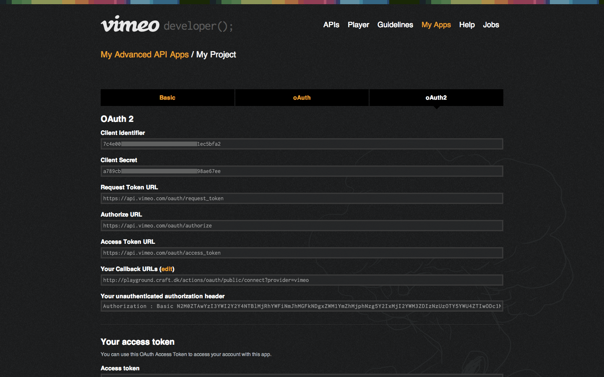

# Connect to Vimeo

## 1. Configure Vimeo OAuth

Go to Admin / OAuth / Vimeo Settings and copy **Web Origin** and **Redirect URL** values.

## 2. Create a Vimeo App

Create a new Vimeo App in Vimeo Developer, and make sure to fill **App URL** and **App Callback URL** fields.

## 3. Client ID & Secret

Under the OAuth 2 tab, copy the **client ID** and **secret** from the Vimeo app we've just created to your OAuth Vimeo settings in Craft.

## 4. Connect to Vimeo

Once everything is setup, go to **Admin / Settings / Plugins / Videos** and connect to Vimeo.

