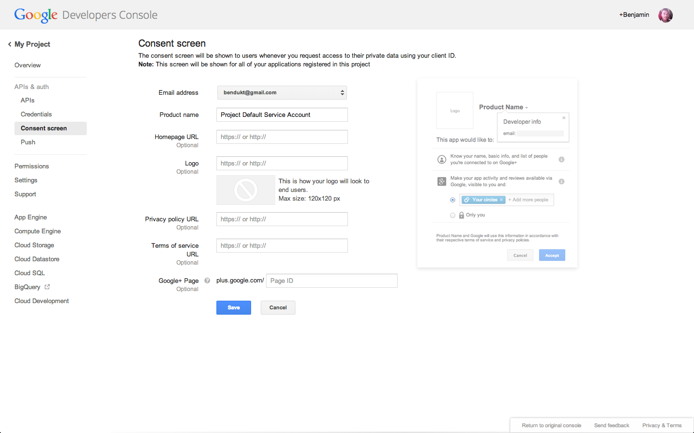

# Connect to YouTube

## 1. Configure Google OAuth

Go to **Admin / OAuth / Google Settings** and copy **Web Origin** and **Redirect URL**.

## 2. Create a Google Console Project

Go to the [Google Console](https://code.google.com/apis/console/) and create a new project.

## 3. Enable YouTube APIs

Under **My Project / APIs & Auth / APIs**, enable the following services:

-  YouTube Analytics API
-  YouTube Data API v3

## 4. Create a client ID

Go to **My Project / Credentials** and create a new client ID.

Here you can paste the **Web Origin** and **Redirect URL** that we copied earlier.

Once created, copy the **client ID** and **secret**, we're going to need them later.

## 5. Product Name

Go to **My Project / Consent Screen** and make sure that the Product name field is **not** empty.

## 6. Set Client ID & Secret

Paste the **client ID** and **secret** from the Google Console.

## 7. Connect to YouTube

Go to **Admin / Plugins / Settings / Videos** and connect to YouTube.

## Localhost Usage

Google is very restrictive on domains that you can use when requesting their API. The request has to come from public domains or localhost :

- localhost
- site.com
- sub.site.com

Unfortunately, it will **not** work for local domains like these :

- site.local
- site.dev

You can trick Google by using a real domain for your dev virtual host, like this :

- local.site.com
- site.dk (or any alternative domain)

Just keep in mind that any public domain that you set up to point to your localhost won't be accessible anymore from your computer.
